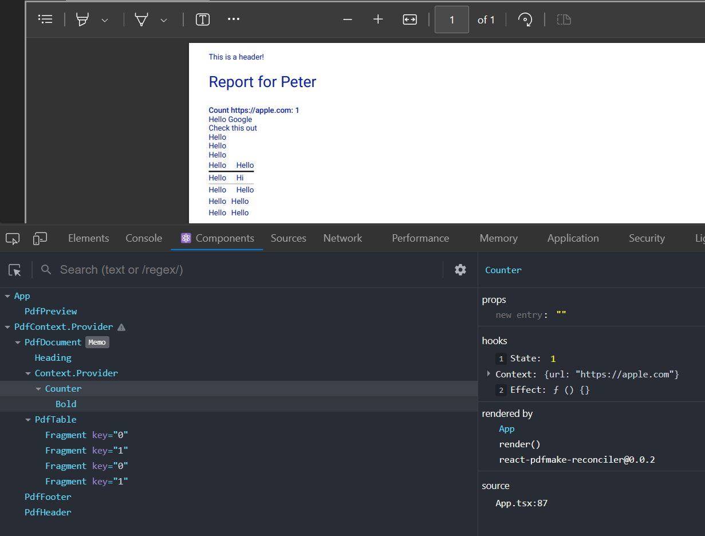

# React PDF Make Reconciler

This package lets you create PDFs using PDF Make and React.

[](https://www.npmjs.com/package/react-pdfmake-reconciler)

## Installation

This package is available on [NPM](https://www.npmjs.com/package/react-pdfmake-reconciler).

```shell
npm i react-pdfmake-reconciler
```

## Features

- Write complex PDF in JSX. Render JSX into PDF Make content structure.
- Utilize React features like:
  - Context. Note that outside React contexts do not penetrate into PDF renderer.
  - Components
  - Hooks
- Working React update loop, (although it is unlikely to trigger user events inside PDF.), e.g.
  - async setState calls
  - useEffect call
- TypeScript typing for PDF Make Components (`<pdf-*>` components)
- React Developer Tools support



## Running demo

```shell
pnpm i
pnpm dev
```

## Usage

See `/demo` and [tests](./src/__tests__/PdfRenderer.test.tsx) for more extensive examples.

### Simple examples

```tsx
/// <reference types="react-pdfmake-reconciler/react-jsx" />

import { PdfRenderer } from "react-pdfmake-reconciler/PdfRenderer";

const { unmount } = PdfRenderer.render(
  <pdf-text bold>Hello World!</pdf-text>,
  (document) => console.log(document),
);

/*
Console:
{
  content: {
    $__reactPdfMakeType: 'pdf-text',
    text: 'Hello World!',
    bold: true
  }
}
*/

// Call unmount to detach node tree.
unmount();
```

```tsx
import { PdfRenderer } from "react-pdfmake-reconciler/PdfRenderer";

const document = PdfRenderer.renderOnce(<pdf-text bold>Hello World!</pdf-text>);
```

### PDF elements

Newly defined intrinsic elements by this package have the `pdf-` prefix. Roughly speaking, each type of PDF Make content object corresponds to one element type, where the property specifying the `Content` is mapped to the `children` prop. For example:

```tsx
const pdfMakeContent = {
  text: "GitHub",
  link: "https://www.github.com",
};

// is mapped to

const pdfNode = <pdf-text link="https://www.github.com">GitHub</pdf-text>;
```

There are also virtual element types. For more information, read [JSDocs in types](./src/types/PdfElements.ts) for more information.

### Document, Header, and Footer

You can easily define extra document definition props straight inside your JSX using `<PdfDocument>`. It is optional to put the body of the document inside this component.

Implemented using React Portals, you can define static/dynamic header and footer using `<PdfHeader>` and `<PdfFooter>`.

These components can appear anywhere within your JSX structure, although you may follow this convention for a better looking structure:

```tsx
import { PdfDocument, PdfHeader, PdfFooter } from "react-pdfmake-reconciler";

const pdfNode = (
  <PdfDocument orientation="landscape">
    {/* Example static header */}
    <PdfHeader>This is a header</PdfHeader>
    {/* Example dynmaic footer */}
    <PdfFooter>
      {(pageNumber, pageCount) => (
        <pdf-text>
          Page {pageNumber} / {pageCount}
        </pdf-text>
      )}
    </PdfFooter>
    {bodyGoesHere}
  </PdfDocument>
);
```

### PdfPreview

`<PdfPreview>` provides an easy way to render your React PDF Make Reconciler JSX in the browser. You can also debug your PDF JSX using the [React Developer Tools](https://chromewebstore.google.com/detail/react-developer-tools/fmkadmapgofadopljbjfkapdkoienihi) browser extension.

```tsx
import { FC, StrictMode } from "react";
import { PdfPreview } from "react-pdfmake-reconciler";

const App: FC = () => (
  <div>
    <PdfPreview>
      {/* Optional */}
      <StrictMode>
        {/* Only use components that resolves to pdf-* components from here on out. DOM elements won't work. */}
        <pdf-text>Hello World!</pdf-text>
      </StrictMode>
    </PdfPreview>
  </div>
);
```
